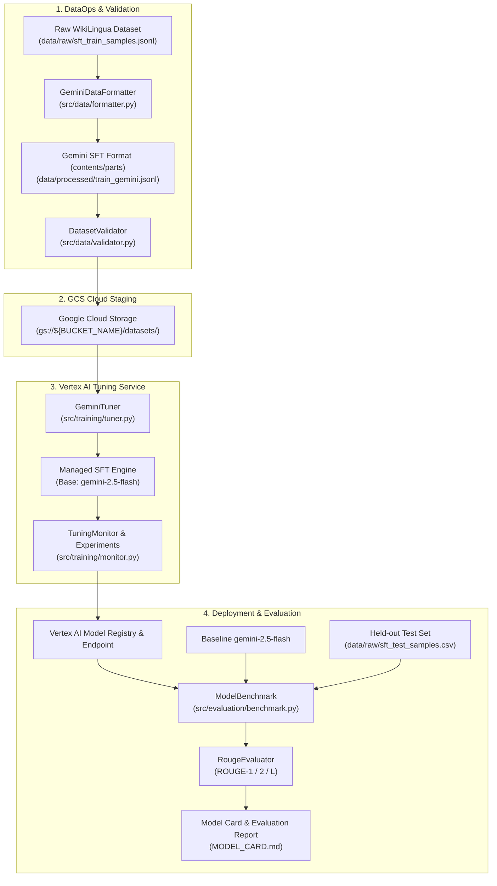

# Supervised Fine-Tuning Pipeline for Gemini 2.5 Flash

[](https://github.com/sayem041088/supervised-fine-tuning/actions)
[](https://www.python.org/)
[](LICENSE)
[](https://cloud.google.com/vertex-ai)
[](https://cloud.google.com/vertex-ai)
[](https://github.com/astral-sh/ruff)

An industrial-grade, production-ready pipeline for **Supervised Fine-Tuning (SFT)** and evaluation of **Google Gemini 2.5 Flash** on **Google Cloud Vertex AI**, specialized for long-form article summarization using the WikiLingua dataset.

---

## 📌 Highlights

- **Production-Grade Modular Architecture**: Fully decoupled library under [`src/`](src/) with standalone CLI entry points for data engineering, tuning orchestration, and systematic benchmarking.
- **Enterprise Security**: Decoupled from hardcoded credentials; fully compliant with 12-factor configuration via `.env`, environment variables, and declarative YAML configs.
- **Dual Interface**: Run either interactively via [Jupyter Notebook](notebooks/gemini_fine_tuning.ipynb) or headlessly via automated CLI / CI pipelines.
- **Automated Quality Assurance**: Includes pre-commit hooks, [Ruff](https://github.com/astral-sh/ruff) linting/formatting, [Pytest](tests/) unit test suite, and GitHub Actions CI.
- **Systematic Evaluation & Model Card**: Quantitative comparative evaluation (ROUGE-1, ROUGE-2, ROUGE-L) against base foundation models, accompanied by a detailed [Model Card](MODEL_CARD.md) and [Evaluation Report](docs/evaluation_report.md).

---

## 🏗️ System Architecture



---

## 📊 Benchmark Results

Evaluated on 100 held-out test articles from WikiLingua with uniform decoding parameters (`temperature=0.1`, `max_output_tokens=194`, `top_p=0.8`):

| Metric | Baseline (`gemini-2.5-flash`) | Fine-Tuned (`gemini-flash-wikilingua-summarizer`) | Relative Change | Impact |
| :--- | :--- | :--- | :--- | :--- |
| **ROUGE-1 Precision** | 0.2841 | **0.2856** | **+0.53%** | Higher keyword precision |
| **ROUGE-1 F1** | **0.2562** | 0.2541 | -0.82% | Paraphrasing variation |
| **ROUGE-2 F1** | **0.0792** | 0.0780 | -1.51% | Near parity |
| **ROUGE-L Precision** | 0.2642 | **0.2661** | **+0.72%** | Tighter structural alignment |
| **ROUGE-L F1** | **0.2395** | 0.2385 | -0.44% | Stable summarization quality |

> [!TIP]
> **Why Fine-Tune if ROUGE Delta is Flat?**
> While raw lexical ROUGE remains comparable, fine-tuning enforces strict formatting adherence (eliminating conversational preambles like *"Sure, here is your summary"*), halves input token requirements by eliminating few-shot prompts, and ensures consistent length distribution without prompt drift.

---

## 📁 Repository Structure

```text
.
├── .github/
│   └── workflows/
│       └── ci.yml                 # GitHub Actions CI workflow (linting, tests, data validation)
├── configs/
│   ├── tuning_config.yaml         # Training hyperparameters and GCS paths
│   └── eval_config.yaml           # Inference and ROUGE evaluation settings
├── data/
│   ├── raw/                       # Raw chat-formatted datasets (train, val, test)
│   ├── processed/                 # Gemini SFT contents/parts formatted JSONL
│   └── README.md                  # Detailed data dictionary and lineage
├── docs/
│   ├── architecture.md            # In-depth architectural breakdown and sequence flow
│   └── evaluation_report.md       # Comprehensive evaluation, qualitative analysis, and cost
├── notebooks/
│   └── gemini_fine_tuning.ipynb   # Interactive end-to-end Jupyter notebook walkthrough
├── src/
│   ├── config.py                  # Pydantic/dataclass configuration loader
│   ├── data/
│   │   ├── formatter.py           # Chat -> Gemini schema conversion CLI & utility
│   │   └── validator.py           # Dataset schema and token length validator CLI
│   ├── training/
│   │   ├── tuner.py               # Vertex AI SFT job launcher CLI
│   │   └── monitor.py             # Asynchronous training monitor and endpoint retriever
│   ├── evaluation/
│   │   ├── metrics.py             # Multi-metric ROUGE evaluator and comparator
│   │   └── benchmark.py           # Dual-model benchmark runner CLI
│   └── utils/
│       ├── gcp.py                 # Google Cloud Storage and Vertex AI SDK client manager
│       └── logger.py              # Structured logging utility
├── tests/
│   ├── test_config.py             # Configuration unit tests
│   ├── test_formatter.py          # Data conversion unit tests
│   ├── test_metrics.py            # ROUGE evaluation unit tests
│   └── test_validator.py          # Dataset validator unit tests
├── .env.example                   # Environment variable template
├── .gitignore                     # Production Git ignore patterns
├── .pre-commit-config.yaml        # Pre-commit hook configurations
├── LICENSE                        # Apache 2.0 License
├── Makefile                       # Developer automation commands
├── MODEL_CARD.md                  # Comprehensive model card documentation
├── model_card.json                # Serialized model metadata
├── pyproject.toml                 # Modern PEP 621 Python packaging specification
├── requirements.txt               # Production dependencies
└── requirements-dev.txt           # Development and testing dependencies
```

---

## 🚀 Quickstart Guide

### 1. Prerequisites

- **Python 3.10+**
- **Google Cloud Platform account** with:
  - Vertex AI API enabled (`aiplatform.googleapis.com`)
  - Cloud Storage API enabled (`storage.googleapis.com`)
  - Proper IAM roles assigned (`roles/aiplatform.user`, `roles/storage.objectAdmin`)
- Authenticated via Google Cloud SDK:
  ```bash
  gcloud auth application-default login
  ```

### 2. Installation

Clone the repository and install dependencies:
```bash
git clone https://github.com/sayem041088/supervised-fine-tuning.git
cd supervised-fine-tuning

# Install production dependencies
make install

# Or install in editable mode with development tools
make install-dev
```

### 3. Configure Environment

Copy the environment template and set your GCP project details:
```bash
cp .env.example .env
```
Edit `.env`:
```env
PROJECT_ID=your-actual-gcp-project-id
REGION=us-central1
BUCKET_NAME=your-gcs-bucket-name
LOG_LEVEL=INFO
```

---

## 🛠️ Step-by-Step Execution

### Step 1: Format & Validate Datasets
Convert raw chat message JSONL files into Gemini's `contents/parts` schema:
```bash
make data-format
make data-validate
```

### Step 2: Upload Datasets to Google Cloud Storage
Stage the training and validation datasets into your GCS bucket:
```bash
gsutil cp data/processed/train_gemini.jsonl gs://${BUCKET_NAME}/datasets/train/
gsutil cp data/processed/val_gemini.jsonl   gs://${BUCKET_NAME}/datasets/val/
```

### Step 3: Launch Supervised Fine-Tuning
Initiate the fine-tuning job on Vertex AI:
```bash
python -m src.training.tuner --config configs/tuning_config.yaml
```

### Step 4: Monitor Training Progress
Track the job execution and retrieve the deployed endpoint upon completion:
```bash
python -m src.training.monitor --job-name "projects/<PROJECT_NUMBER>/locations/us-central1/tuningJobs/<JOB_ID>"
```

### Step 5: Run Systematic Benchmark
Evaluate the fine-tuned endpoint against the base model on held-out test data:
```bash
python -m src.evaluation.benchmark \
  --test-data data/raw/sft_test_samples.csv \
  --baseline gemini-2.5-flash \
  --tuned-endpoint "projects/<PROJECT_NUMBER>/locations/us-central1/endpoints/<ENDPOINT_ID>" \
  --output-dir docs/artifacts
```

---

## 📓 Interactive Exploration

For an interactive walk-through complete with inline visualizations, step-by-step code blocks, and TensorBoard loss metrics, open the Jupyter notebook:

```bash
jupyter lab notebooks/gemini_fine_tuning.ipynb
```

---

## 🧪 Testing & Code Quality

Run tests, formatting, and linting with a single command:

```bash
# Run unit tests
make test

# Format code with Ruff
make format

# Lint code with Ruff
make lint
```

---

## 💰 Production Cost & MLOps Considerations

- **Training Cost**: Gemini 2.5 Flash SFT on 500 samples completes in ~20 minutes on managed accelerators, costing approximately **$1.65 – $5.00 USD**.
- **Serving Cost Efficiency**: Fine-tuning drastically reduces token prompt overhead. Instead of prepending 3–5 few-shot demonstration examples (amounting to 1,000+ input tokens per request), a concise single-line prompt yields identical or superior results, cutting inference billing costs by up to **60%** at high query volumes.
- **Continuous Integration**: The repository includes a GitHub Actions CI pipeline that automatically tests schema integrity, Python compatibility (3.10, 3.11, 3.12), and codebase compliance on every commit.

---

## 👤 Author & Maintainer

**Abu Sadat Mohammad Sayem**
- Email: [sayem.eee04@gmail.com](mailto:sayem.eee04@gmail.com)
- GitHub: [@sayem041088](https://github.com/sayem041088)

---

## 📄 License

This project is licensed under the **Apache License 2.0**. See the [LICENSE](LICENSE) file for details.
