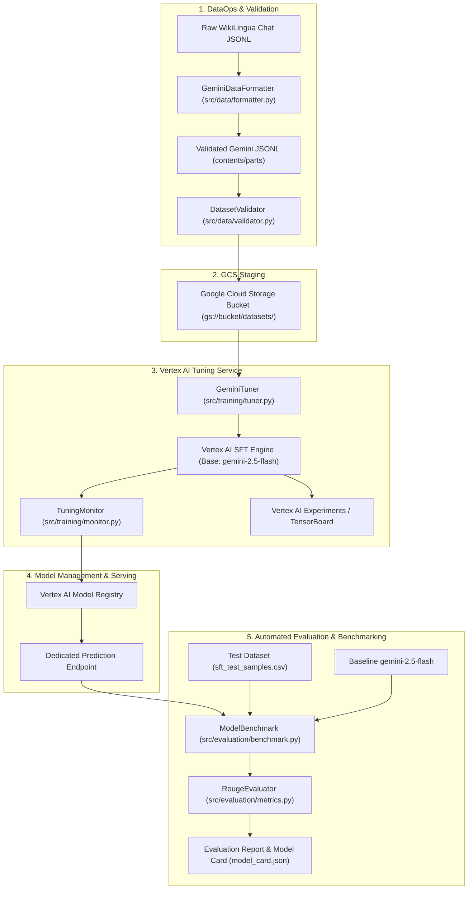

# System Architecture: Vertex AI Gemini Fine-Tuning Pipeline

This document provides a technical architecture overview of the end-to-end Supervised Fine-Tuning (SFT) lifecycle for Gemini 2.5 Flash on Google Cloud Vertex AI.

---

## 1. High-Level Pipeline Architecture

---

## 2. Component Breakdown

### 2.1 Data Ingestion & Transformation (`src/data`)
- **Schema Mapping**: Converts multi-turn OpenAI/HuggingFace style messages `[{"role": "...", "content": "..."}]` into Gemini's `contents` hierarchy `[{"role": "...", "parts": [{"text": "..."}]}]`.
- **Validation Rules**:
  - Validates turn structure (strictly alternating or user-first).
  - Enforces minimum and maximum token/character lengths.
  - Ensures zero empty parts to avoid silent Vertex AI ingestion rejection.

### 2.2 Cloud Staging & Storage (`src/utils/gcp.py`)
- Vertex AI SFT requires dataset files to be accessible over Cloud Storage (`gs://`).
- Files are staged in structured prefixes:
  - `gs://<BUCKET_NAME>/datasets/train/train_gemini.jsonl`
  - `gs://<BUCKET_NAME>/datasets/val/val_gemini.jsonl`

### 2.3 Training Orchestration (`src/training`)
- **Engine**: Google Vertex AI Tuning API (`google-genai` and `vertexai` SDKs).
- **Base Model**: `gemini-2.5-flash`.
- **Tuning Mechanism**: Supervised parameter-efficient fine-tuning (LoRA / adapter layers), optimizing cross-entropy loss over target completion tokens while conditioning on input prompts.
- **Monitoring**: Asynchronous job polling with state transitions (`JOB_STATE_PENDING` -> `JOB_STATE_RUNNING` -> `JOB_STATE_SUCCEEDED`).
- **Telemetry**: Metrics streamed to Vertex AI Experiments backing TensorBoard for loss curve visualization.

### 2.4 Evaluation Framework (`src/evaluation`)
- **Dual-Model Inference**: Queries the base `gemini-2.5-flash` model and the fine-tuned Vertex AI endpoint simultaneously on unseen test prompts under identical decoding constraints (`temperature=0.1`, `max_output_tokens=194`, `top_p=0.8`).
- **Standardized Metrics**: Computes ROUGE-1, ROUGE-2, and ROUGE-L (Precision, Recall, F1) using Porter stemmer.
- **Delta Analysis**: Calculates percentage improvements and length variance between baseline zero-shot responses and fine-tuned completions.

---

## 3. Security, Governance, and Best Practices

1. **Decoupled Credentials**: Never commit GCP Project IDs, service account keys, or bucket names directly into code. All values are read from environment variables or `.env`.
2. **IAM Principle of Least Privilege**:
   - `roles/aiplatform.user`: Execute tuning jobs and interact with endpoints.
   - `roles/storage.objectViewer` / `roles/storage.objectAdmin`: Stage datasets in GCS.
3. **Reproducibility**: Parameter definitions are tracked in declarative YAML configs under `configs/`.
